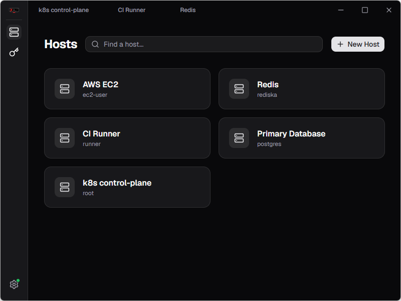
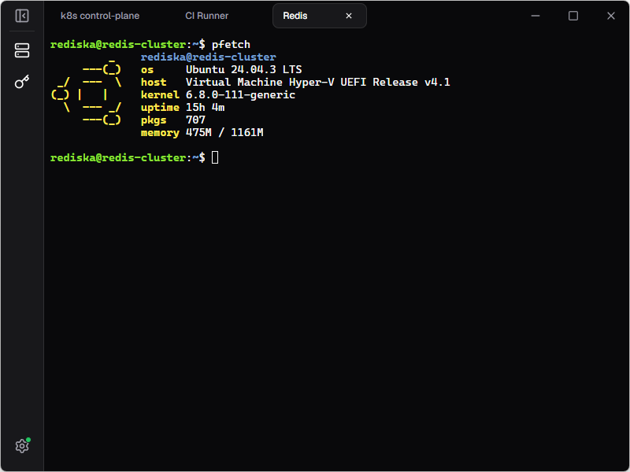

<h1 align="center">

Terminator

   

</h1>

<div align="center">

   [](https://discord.gg/x7K9BRrQJE)
   
</div>

<h3 align="center">
   Self-hostable SSH client with sync
</h3>

Terminator is a cross-platform SSH client built with [Wails v3](https://v3.wails.io/) and Go. Supports self-hosted servers for sync.

## Features
- **Encryption.** All sensitive data is encrypted locally using Argon2id and AES-256GCM.
- **Sync** encrypted data across multiple devices. Data is encrypted *before* it leaves the client!
- **Lightweight.** ~15MB binaries, ~10MB RAM.
- Cross-platform:
   - [Windows](https://github.com/terminator-ssh/terminator-desktop/releases/latest/download/Terminator-windows-stable-Setup.exe)
   - [Linux](https://github.com/terminator-ssh/terminator-desktop/releases/latest/download/Terminator-linux-stable.AppImage)
   - [MacOS](https://github.com/terminator-ssh/terminator-desktop/releases/latest/download/Terminator-macos-stable-Setup.pkg)
- Local first. You *don't have to* use a server!

## Server
Terminator is designed as a local-first app, but it supports E2E encrypted sync. Grab the server [here](https://github.com/terminator-ssh/terminator-server)!

## Roadmap
- [x] Encryption
- [x] Sync
- [x] SSH keys
- [ ] Host groups
- [ ] Interactive passwords
- [ ] Multiple profiles (teams?)
- [ ] Custom themes
- [ ] Shortcuts
- [ ] Android client
- [ ] CLI client
- [ ] SFTP

Something missing? Suggest more! [Issues](https://github.com/terminator-ssh/terminator-desktop/issues/new) | [Discord](https://discord.gg/x7K9BRrQJE)

## Screenshots



## Development

### Prerequisites

1. [**Go**](https://go.dev/dl/) (1.25+)
2. [**Node.js**](https://nodejs.org/en/download/current) (v24+)
3. *Preferrably* [**pnpm**](https://pnpm.io/installation#using-corepack)
4. [**Wails3 CLI**](https://v3.wails.io/getting-started/installation/)

### Build

For development: just
```
wails3 dev
```

Debug: use remote debug and [delve](https://github.com/go-delve/delve/tree/master/Documentation/installation):
```sh
dlv debug --headless --listen=:2345 ./backend/cmd/terminator-desktop -- dev
```


Package:
```
wails3 task package
```

### Acknowledgements

Inspired by: [Termius](https://termius.com)

Built on: [Wails](https://v3.wails.io)

Beautiful UI: [shadcn](https://ui.shadcn.com)
